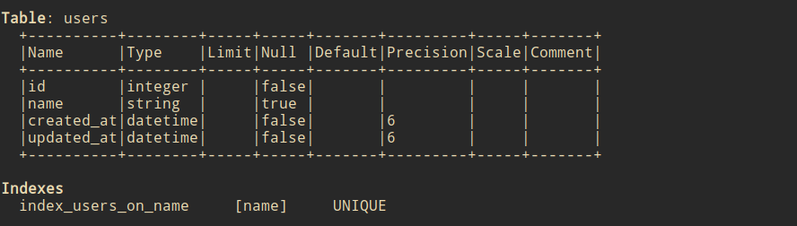
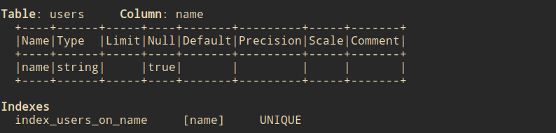
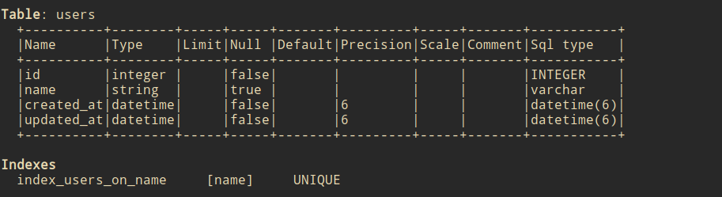

# TableInspector
This is a rails gem for print the definition of table. Sometimes we use some gems to embed the table schema to model file(like `annotate`).
but sometimes it is hard to maintain, and it has a little noise. I want to find another way to check the schema of table instead of 
using `annotate`, So I wrote this gem to do this.

## Usage
Assuming there is a model call `User` which has `id` and `name` column, and has a unique index for `name`.
For print the definition of User, we can use: 
```ruby
require "table_inspector"

TableInspector.scan User
```



It will print the all table definition and all indexes.

And to print specific column by:

```ruby
TableInspector.scan User, :name
```


It will print the column definition and which indexes that contains this column.

Also, you can print `sql_type` which type of column in database by provide `sql_type: true` option: 



## Installation
Add this line to your application's Gemfile:

```ruby
gem "table_inspector"
```

And then execute:
```bash
$ bundle
```

Or install it yourself as:
```bash
$ gem install table_inspector
```

## Contributing
Contribution directions go here.

## License
The gem is available as open source under the terms of the [MIT License](https://opensource.org/licenses/MIT).
